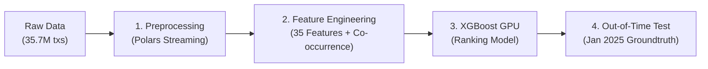

# Personalized E-Commerce Recommendation System

Hệ thống gợi ý và xếp hạng sản phẩm cho chuỗi bán lẻ Mẹ & Bé, huấn luyện trên 35.7 triệu giao dịch thực tế năm 2024 và kiểm thử mù trên Tháng 01/2025.

---

## 📌 Tổng quan Dự án

- **Dữ liệu**: 35.7M dòng giao dịch mua sắm gồm 2.4M khách hàng và 20.8K sản phẩm.
- **Công nghệ**: Python, Polars, XGBoost, Pandas, NumPy.
- **Mô hình**: XGBoost Classifier kết hợp Hybrid Fallback xử lý Cold-Start.
- **Mục tiêu**: Dự đoán xác suất mua hàng và xuất Top 10 sản phẩm tối ưu cho từng khách hàng.

---
## Tổng quan Dữ liệu (Dataset Overview)

Tập dữ liệu ghi nhận lịch sử giao dịch thực tế từ nền tảng thương mại điện tử với hơn 35.7 triệu giao dịch:
- `users`: Thông tin nhân khẩu học của người dùng (giới tính, nhóm độ tuổi, tỉnh/thành phố).
- `items`: Thông tin siêu dữ liệu của sản phẩm (ngành hàng, danh mục con, thương hiệu, giá bán).
- `purchases`: Nhật ký giao dịch mua hàng (mã người dùng, mã sản phẩm, thời gian giao dịch, số lượng, tổng tiền).

*(Lưu ý: Toàn bộ dữ liệu đã được ẩn danh hóa nhằm mục đích nghiên cứu và thử nghiệm mô hình. Liên kết tải dữ liệu được cung cấp khi có yêu cầu).*

## Kiến trúc & Quy trình Thực hiện



1. **Preprocessing**: Làm sạch dữ liệu 3 bảng `items`, `users`, `purchases` bằng Polars, loại bỏ cột dư thừa, chuẩn hóa địa chỉ 63 tỉnh thành.
2. **Feature Engineering**:
   - **User Features**: RFM (Recency, Frequency, Monetary), tuổi tài khoản, tỷ lệ săn sale, giá mua trung bình.
   - **Item Features**: Doanh số lịch sử, số người từng mua, ngành hàng L1/L2, thương hiệu, mức giá.
   - **Cross & Affinity Features**: Lịch sử mua lặp lại, mức độ tương hợp giá cả, sở thích thương hiệu/ngành hàng.
   - **Basket Co-occurrence**: Khai thác luật mua kèm từ hơn 6.1 triệu giỏ hàng.
3. **Chiến lược huấn luyện**:
   - Time-based Split: 10 tháng đầu năm 2024 làm quá khứ, 2 tháng cuối năm 2024 làm nhãn.
   - Negative Sampling: Tỷ lệ 1 Dương : 2 Âm (~15.1 triệu dòng train).
4. **Xử lý Cold-Start**:
   - Tự động nhận diện 160K khách hàng mới (chưa có lịch sử giao dịch trước đây) và gợi ý theo Top sản phẩm bán chạy nhất tại chính Tỉnh/Thành của họ

---

## Kết quả Đánh giá trên Groundtruth (Tháng 01/2025)

Đánh giá thực tế trên 644,970 khách hàng phát sinh đơn hàng trong Tháng 01/2025:

| Nhóm khách hàng | HitRate@10 | Precision@10 | NDCG@10 |
| :--- | :---: | :---: | :---: |
| **Khách quen (Warm Users)** | **50.1%** | **8.8%** | **0.254** |
| **Khách mới (Cold-Start)** | **11.4%** | **1.4%** | **0.031** |
| **Toàn bộ hệ thống (Full)** | **40.2%** | **6.2%** | **0.185** |

---

## 📂 Cấu trúc Thư mục

```text
├── preprocessing/
│   ├── process_item.ipynb          # Làm sạch bảng sản phẩm
│   ├── process_user.ipynb          # Chuẩn hóa tỉnh thành bảng khách hàng
│   └── process_purchase.ipynb      # Tiền xử lý 35.7M giao dịch mua hàng
├── train_data/
│   ├── item_cooccurrence.parquet   # Ma trận luật mua kèm từ giỏ hàng
│   ├── train_model.ipynb           # Huấn luyện mô hình XGBoost trên GPU
│   ├── evaluate_groundtruth.ipynb  # Đánh giá trên Groundtruth tháng 1/2025
│   └── model/
│       └── xgboost_ranking.json    # File mô hình XGBoost đã train
├── feature_engineering.ipynb       # Tạo 35+ đặc trưng và tập train
└── README.md